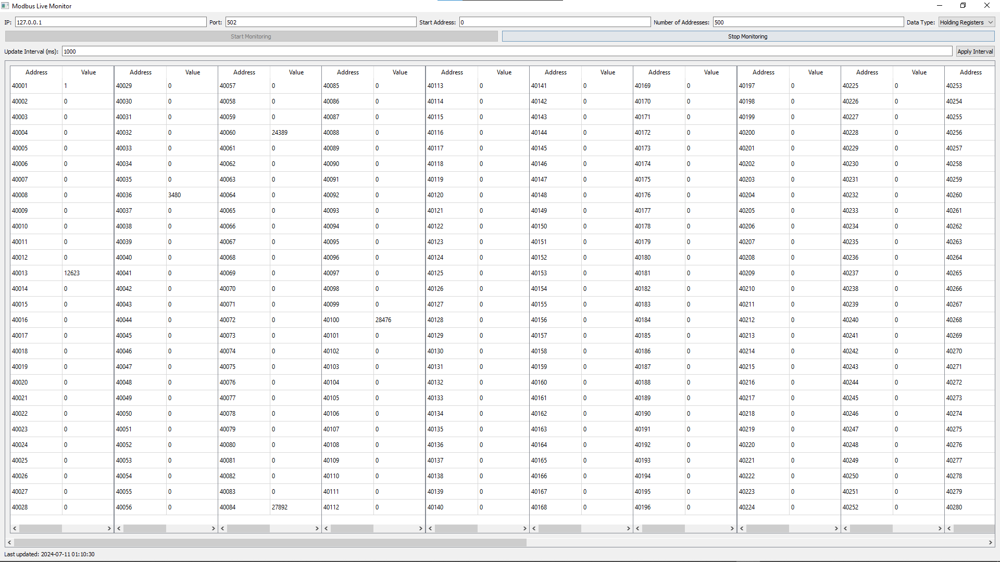

# Modbus Live Monitor

The Modbus Live Monitor is a Python application designed to facilitate real-time monitoring of Modbus devices. This tool is perfect for developers and engineers working with industrial applications that utilize the Modbus protocol. The application connects to Modbus devices over TCP/IP and provides a graphical user interface to display register values dynamically.

## Features

- **Connection Setup**: Easily configure connection parameters including IP address and port.
- **Register Configuration**: Specify the start address and the number of Modbus registers to monitor.
- **Dynamic Monitoring**: Start and stop the monitoring process with a simple click.
- **Real-Time Data Display**: Values are displayed in a table that updates based on the specified interval.
- **Status Updates**: View connection status and last update time directly within the GUI.
- **User-Friendly Interface**: Built using PyQt5, offering a robust and intuitive interface.

## Prerequisites

Before you can run Modbus Live Monitor, you need to have Python installed on your system (Python 3.6 or later is recommended). Additionally, the following Python packages are required:

- PyQt5
- pymodbus

These dependencies can be installed using the following command:

```bash
pip install -r requirements.txt
```

## Installation

1. Clone this repository:

```bash
git clone https://github.com/NNikoGG/modbus-live-monitor.git
```

2. Navigate to the cloned repository:

```bash
cd modbus-live-monitor
```

3. Install the required packages:

```bash
pip install -r requirements.txt
```

## Usage

To run the application, execute the following command in the terminal:

```bash
python modbus-live-monitor.py
```

Ensure you have a Modbus server running. For simulation and testing, you can use software like [Modsim](https://www.win-tech.com/html/demos.htm "Modsim") or any other Modbus protocol simulation software.

## Configuration

Upon launching, you will be prompted to enter:

- **IP Address**: IP address of the Modbus device or simulation software.
- **Port**: Communication port (default is 502).
- **Start Address**: The starting address of the Modbus registers to monitor.
- **Number of Addresses**: How many consecutive addresses to monitor.
- **Update Interval (ms)**: How often the software updates the displayed values.

## GUI


